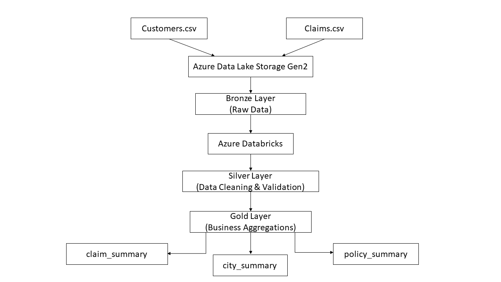

## Architecture Diagram

# Insurance Claims Data Engineering Project

## Project Overview

This project demonstrates an end-to-end Data Engineering pipeline built using Azure Databricks, Azure Data Lake Storage Gen2 (ADLS Gen2), Delta Lake, and Medallion Architecture.

The objective of this project is to process insurance customer and claims data through Bronze, Silver, and Gold layers while implementing data ingestion, transformation, data quality checks, and business aggregations.

---

## Architecture

Source Files (CSV)

↓

Bronze Layer (Raw Data)

↓

Silver Layer (Cleaned & Validated Data)

↓

Gold Layer (Business Aggregations)

---

## Technologies Used

* Azure Databricks
* Azure Data Lake Storage Gen2 (ADLS Gen2)
* Delta Lake
* PySpark
* Azure Cloud

---

## Data Sources

### customers.csv

Contains customer information such as:

* Customer ID
* Customer Name
* Policy Type
* Premium Amount
* City

### claims.csv

Contains insurance claim information such as:

* Claim ID
* Customer ID
* Claim Type
* Claim Amount
* Claim Status

---

## Bronze Layer

* Raw CSV files ingested from ADLS
* Data stored in Delta format
* No transformations applied

---

## Silver Layer

Implemented data quality checks:

* Removed duplicate records
* Handled null values
* Removed invalid customer references
* Standardized data types

---

## Gold Layer

Created business-level aggregations:

### Claim Summary

* Total claims by status
* Total claim amount by status

### City Summary

* City-wise claim analysis
* Total claim amount by city

### Policy Summary

* Policy-wise premium analysis
* Policy-wise claim analysis

---

## Project Outcomes

* Implemented Medallion Architecture
* Built scalable Delta Lake pipeline
* Performed data quality validation
* Created business-ready analytical datasets

---

## Author

Parash Mehara
Data Engineering Project
